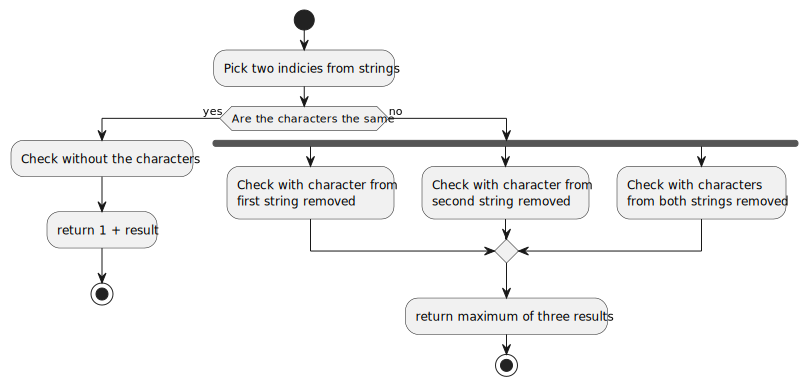

# Longest Common Subsequence

## Description

Longest Common Subsequence is a simple and very popular dynamic programming
problem. In essence a subsequence of a string is any number of characters that
has the same order as the string. For example `Coding is great!` has
a subsequence `neat`

In this problem we are given two strings A and B and we want to find
the lenght of longest common subsequence of A and B.

## Recursive Solution

Let us consider a recursive algorithm.

1. If at any point we have an empty string then our longest common Subsequence
has lenght 0.

2. Consider at any point, we found that two characters are the same.
Then we definetly know that the lenght of longest common subsequence is at
least 1. It may be more, so we have to check the rest of the string without
common character.

3. Consider at any point we found that two characters are not the same
then we know that longest common subsequence of our strings is the same as the
longest common subsequence of strings which at least one character from our
original string removed.

We can visualize our algorithm as following:

